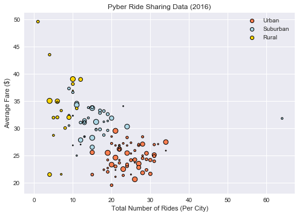
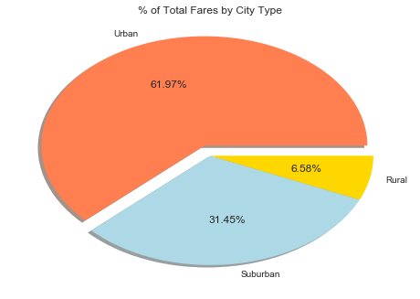
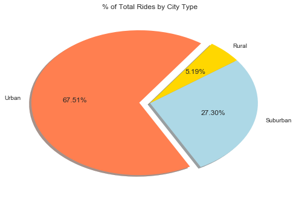
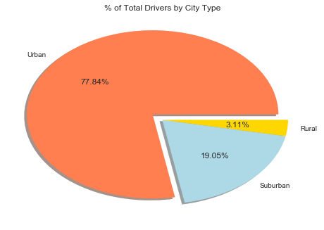

# Pyber

-----

### Analysis

- Almost 80% of Uber drivers work in urban areas, almost 20% in suburban areas, and about 3% in rural areas. This is a seemingly obvious trend, as populations in these types of areas represent the amount of drivers in each area.
- Suburban and rural fares combine to make up only 38% of total fares across Uber drivers. 62% of their money made from driver fares come from urban areas. Being that rural areas have lower populations, and therefore less drivers, the average fare in higher.
- Conversely, urban areas make up the highest amount of rides and the lowest fare. This also relates to higher population and population density in these places. Since there are more people, there are a higher amount of Uber drivers in urban areas.


```python
import matplotlib.pyplot as plt
import pandas as pd
import numpy as np
import seaborn as sns
```


```python
city_data = pd.read_csv("city_data.csv")
ride_data = pd.read_csv("ride_data.csv")
```


```python
merged = pd.merge(city_data ,ride_data ,on="city")
merged.head()
```


<div>
<style>
    .dataframe thead tr:only-child th {
        text-align: right;
    }

    .dataframe thead th {
        text-align: left;
    }

    .dataframe tbody tr th {
        vertical-align: top;
    }
</style>
<table border="1" class="dataframe">
  <thead>
    <tr style="text-align: right;">
      <th></th>
      <th>city</th>
      <th>driver_count</th>
      <th>type</th>
      <th>date</th>
      <th>fare</th>
      <th>ride_id</th>
    </tr>
  </thead>
  <tbody>
    <tr>
      <th>0</th>
      <td>Kelseyland</td>
      <td>63</td>
      <td>Urban</td>
      <td>2016-08-19 04:27:52</td>
      <td>5.51</td>
      <td>6246006544795</td>
    </tr>
    <tr>
      <th>1</th>
      <td>Kelseyland</td>
      <td>63</td>
      <td>Urban</td>
      <td>2016-04-17 06:59:50</td>
      <td>5.54</td>
      <td>7466473222333</td>
    </tr>
    <tr>
      <th>2</th>
      <td>Kelseyland</td>
      <td>63</td>
      <td>Urban</td>
      <td>2016-05-04 15:06:07</td>
      <td>30.54</td>
      <td>2140501382736</td>
    </tr>
    <tr>
      <th>3</th>
      <td>Kelseyland</td>
      <td>63</td>
      <td>Urban</td>
      <td>2016-01-25 20:44:56</td>
      <td>12.08</td>
      <td>1896987891309</td>
    </tr>
    <tr>
      <th>4</th>
      <td>Kelseyland</td>
      <td>63</td>
      <td>Urban</td>
      <td>2016-08-09 18:19:47</td>
      <td>17.91</td>
      <td>8784212854829</td>
    </tr>
  </tbody>
</table>
</div>


## Bubble Plot of Ride Sharing Data

-----


```python
urban = merged[(merged["type"] == "Urban")]
suburban = merged[(merged["type"] == "Suburban")]
rural = merged[(merged["type"] == "Rural")]

urban_average = urban.groupby("city")["fare"].mean()
suburban_average = suburban.groupby("city")["fare"].mean()
rural_average = rural.groupby("city")["fare"].mean()

urban_rides = urban.groupby("city")["ride_id"].count()
suburban_rides = suburban.groupby("city")["ride_id"].count()
rural_rides = rural.groupby("city")["ride_id"].count()

total = city.groupby("city")["driver_count"].sum()
total.head()
```


    city
    Alvarezhaven    21
    Alyssaberg      67
    Anitamouth      16
    Antoniomouth    21
    Aprilchester    49
    Name: driver_count, dtype: int64


```python
urban_plot = plt.scatter(urban_rides, urban_average, s=total, c='coral', linewidths=1, edgecolor='black')
suburban_plot = plt.scatter(suburban_rides, suburban_average, s=total, c="lightblue", linewidths=1, edgecolor='black')
rural_plot = plt.scatter(rural_rides, rural_average, s=total, c="gold", linewidths=1, edgecolor='black')
plt.xlabel("Total Number of Rides (Per City)")
plt.ylabel("Average Fare ($)")
plt.title("Pyber Ride Sharing Data (2016)")
plt.legend(handles=[urban_plot,suburban_plot,rural_plot], labels=['Urban','Suburban','Rural'])
sns.set
plt.show()
```





## Total Fares by City Type

-----


```python
urban_fare = urban["fare"].sum()
suburban_fare = suburban["fare"].sum()
rural_fare = rural["fare"].sum()

total_fare = [urban_fare, suburban_fare, rural_fare]
explode = [.1,0,0]
labels = ["Urban", "Suburban", "Rural"]
colors = ["coral", "lightblue", "gold"]
plt.pie(totalfare, labels=labels, colors=colors, autopct='%1.2f%%', shadow=True, explode=explode)
plt.title("% of Total Fares by City Type")
sns.set()
plt.show()
```





## Total Rides by City Type

-----


```python
urban_rides = urban["ride_id"].count()
suburban_rides = suburban["ride_id"].count()
rural_rides = rural['ride_id'].count()

total_rides = [urban_rides, suburban_rides, rural_rides]
explode = [.1,0,0]

labels = ["Urban", "Suburban", "Rural"]
colors = ["coral", "lightblue", "gold"]

plt.pie(total_rides, labels=labels, colors=colors, autopct='%1.2f%%', startangle=55, explode=explode, shadow=True)
plt.title("% of Total Rides by City Type")
sns.set()
plt.show()
```





## Total Drivers by City Type

-----


```python
urban_drivers = city[(city["type"]=="Urban")]
urban_drivers = urban_drivers["driver_count"].sum()
suburban_drivers = city[(city["type"]=="Suburban")]
suburban_drivers = suburban_drivers["driver_count"].sum()
rural_drivers = city[(city["type"]=="Rural")]
rural_drivers = rural_drivers["driver_count"].sum()

total_drivers = [urban_drivers, suburban_drivers, rural_drivers]
explode = [.1,0,0]
labels = ["Urban", "Suburban", "Rural"]
colors = ["coral", "lightblue", "gold"]

plt.pie(total_drivers, labels=labels, colors=colors, autopct='%1.2f%%', explode=explode, shadow=True)
plt.title("% of Total Drivers by City Type")
sns.set()
plt.show()
```




